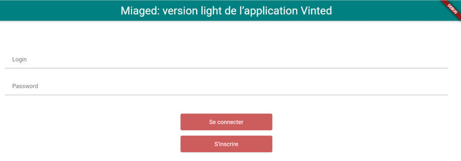
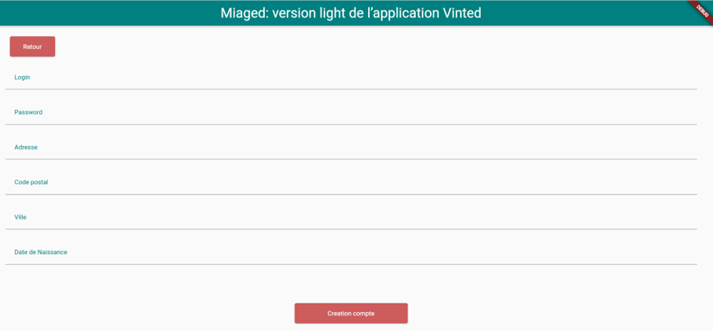
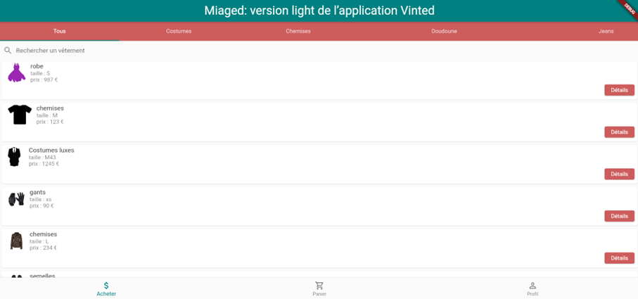
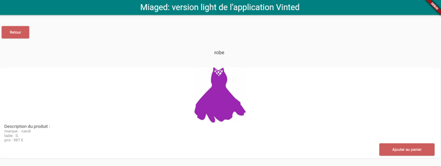
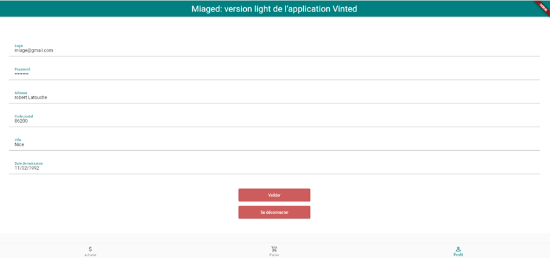
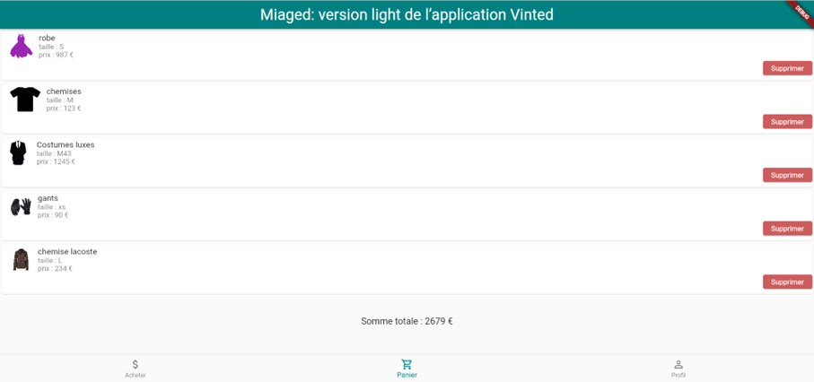
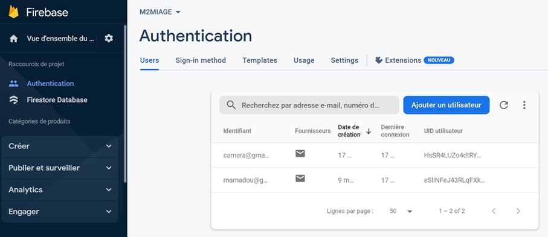
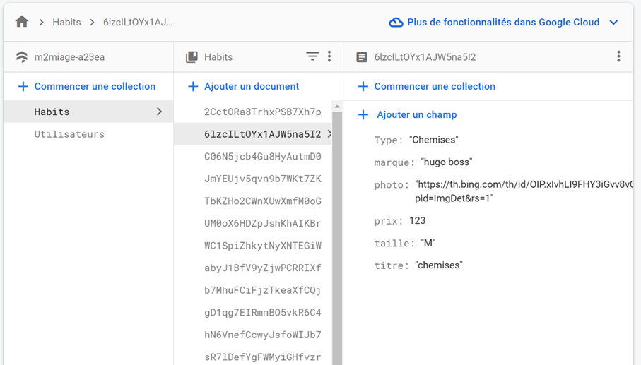
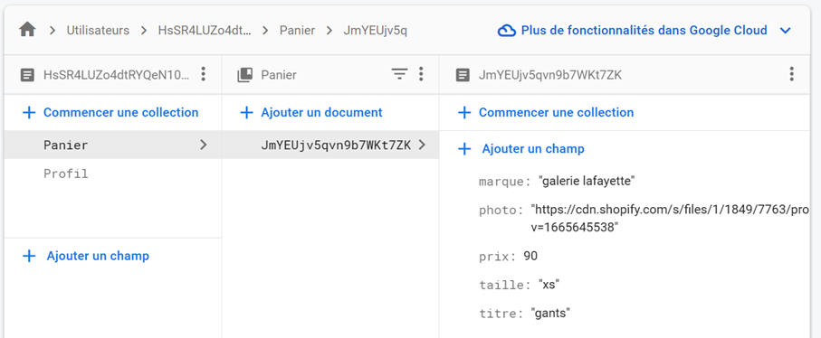

# MIAGED CAMARA MAMADOU
Ce projet est une version light de l’application Vinted(https://www.vinted.fr/), développée dans le cadre d’un projet universitaire. L’application permet aux utilisateurs d’acheter et de vendre des vêtements d’occasion. Celle-ci s’appellera « MIAGED ».
## Firebase
Pour Installer les outils de ligne de commande requis et configurer notre application pour utiliser Firebase (https://firebase.google.com/docs/flutter/setup?platform=web&hl=fr)
## Fonctionnalités
MVP atteint avec les criteres d'acceptations plus imagination pour augmenter

Navigation entre différentes pages : la page principale avec les catégories de vêtements, la page de connexion, la page du panier et la page de profil utilisateur.

Affichage des vêtements disponibles par catégorie.

Ajout et suppression des vêtements au panier.

Connexion à un compte utilisateur pour gérer le profil et les commandes.
## Technologies utilisées
Flutter : framework de développement d’applications mobiles.
Firebase : service de développement d’applications mobiles de Google.
## Installation et utilisation
Cloner le projet depuis GitHub.
Ouvrir le projet avec un éditeur de code compatible avec Flutter.
Installer les packages requis en utilisant la commande .'flutter pub get'
Configurer les informations d’identification Firebase en suivant les instructions fournies dans le fichier .'firebase_options.dart'
Lancer l’application en utilisant la commande ou en utilisant un émulateur de périphérique mobile.'flutter run'
## flutter device
j'ai utilisé chrome (web)
## Information de connexion
Pour vous connecter directement, utilisez:

Login: mamadou@gmail.com

Password: mamadou2023
## Modification profil
Au niveau du profil, pour modifier un champ, il suffit de cliquer dans le champ directement ensuite faire la modification et en fin cliquer sur le bouton Valider
## Interfaces de l'application
Voici certaines interfaces de l'application MIAGED
### Page de connexion

### Page creation compte

### affichage des vetements

### details de vetement

### Page profil
Lorsque l'utilisateur cree son compte

### Page panier

## authentification firebase
Lorsqu'on crée un utilisateur les informations sont sauvegardées
voir par exemple notre utilisateur ci-dessus apparait:

## Firestore Database
Nous avons différentes collections pour la sauvegarde
les Id sont choisis de façon automatique pour les documents des collections
### collection Habits
pour les vetements avec les différentes proprietes

### collection Utilisateurs
cette collection comprend des sous collections Panier et Profil qui se cree automatique a travers les requetes

